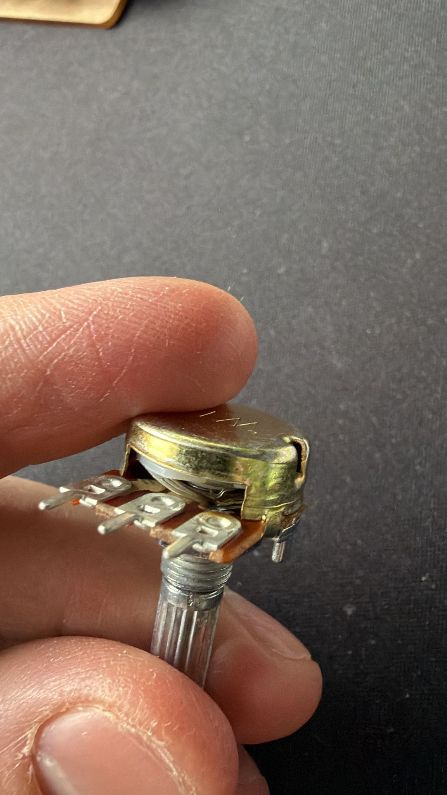

### Week 4 – WiFi, APIs & NeoPixel Integration

### Goal

Explore the WiFi capabilities of the Arduino UNO R4 WiFi, practice connecting to networks and APIs, and attempt to link an external RGB API to a NeoPixel LED strip. Understand the limitations of the hardware (especially regarding SSL), learn debugging strategies for networking problems, and gain experience with troubleshooting hardware mistakes.

---

### Activities

I started this week wanting to work with a potentiometer, but that didn’t last long because I wired it wrong and burned it. I had the wiring guide open, but I still managed to put GND on the middle pin, 5V on the left, and signal on the right, which instantly killed the component and made the whole thing smell like burnt plastic. Since the potentiometer was dead, I decided to switch to experimenting with the WiFi features of the UNO R4 WiFi. I tested both Access Point mode and connecting it to my home network using the Arduino examples from
[https://docs.arduino.cc/tutorials/uno-r4-wifi/wifi-examples/#connect-with-wpa](https://docs.arduino.cc/tutorials/uno-r4-wifi/wifi-examples/#connect-with-wpa), and those parts actually worked fine.

After that, I wanted to connect the Arduino to an external API so I could change my NeoPixel colors based on random RGB values. I first tried using `https://x-colors.yurace.pro/api/random`, but SSL kept failing. To test further, I even built my own API at
[https://random-color.larsvanherwijnen.nl/api/random](https://random-color.larsvanherwijnen.nl/api/random)
(GitHub: [https://github.com/larsvanherwijnen/random-color-api](https://github.com/larsvanherwijnen/random-color-api)), but I ran into the exact same SSL issue. Even something simple like connecting to Google didn’t work over HTTPS, which made me suspect something odd with TLS on the UNO R4 WiFi. I spent a lot of time testing examples, updating the board firmware, and changing code, but nothing fixed it. In the end, switching from HTTPS (443) to plain HTTP (80) finally made everything work and the Arduino was able to fetch RGB values and update the NeoPixel strip correctly.

While dealing with all this, I also ran into the annoying “No device found on cu.usbmodemXXXX” error on macOS when uploading code. That led to another long debugging session where I tested multiple cables, ports, and settings. I eventually wrote a full post on the Arduino forum with all the steps I tried:
[https://forum.arduino.cc/t/arduino-uno-r4-wifi-no-device-found-on-cu-usbmodemxxxx-on-macos/1414787](https://forum.arduino.cc/t/arduino-uno-r4-wifi-no-device-found-on-cu-usbmodemxxxx-on-macos/1414787).

---

### Code / Project

This week’s project focused on combining WiFi communication, JSON parsing, and NeoPixel LED control.

Instead of receiving color changes from user input, the Arduino requests a random RGB value from my API every few seconds and updates the LEDs.

- [Wifi test](./wifi_network/wifi_network.ino)
- [Color changing API](./random_color_api/changing_color_api.ino)

A video recording of the working result is included below.

---

### Pictures

## Burned Potentiometer Wiring (Incorrect)

---

### Video

## NeoPixel color changing using my API (HTTP)
<video src="https://github.com/user-attachments/assets/a54fd3ed-9c3d-44af-828e-2beae56ccd38
" width="350" controls></video>

---

## Reflection

This week didn’t go the way I expected, but I learned a lot from it. Burning the potentiometer showed me how easy it is to break components just by wiring something the wrong way. The biggest frustration was definitely SSL no API worked over HTTPS, not even Google, and I spent hours testing, updating firmware, and trying different code without getting anywhere. Switching everything to plain HTTP was the only thing that finally made the project work.

On top of that, I had another annoying problem where the Arduino was detected in the Arduino IDE, but the moment I tried to flash it, I got the error “No device found on cu.usbmodemXXXX”. That sent me into a whole new round of troubleshooting and searching for solutions. Even though a lot of my time went into fixing problems instead of building new things, it still felt great to finally see the NeoPixel strip change colors using my own API.

### Hours Spent

| Week      | Hours |
|-----------|-------|
| This week | **14** |
| Total     | **38.5** |

